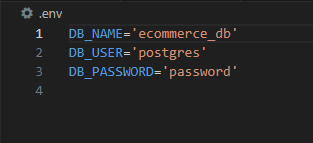

  
  # ORM E-Commerce

  

  ## Description

  This application is designed to showcase understanding of Object-Relational Mapping implemented in an e-commerce database. The database keeps track of and organizes various items that are able to be called by category, products, and Tags, with the ability to create, delete, and updates items.

  ## Table of Contents

  - [Installation](#installation)
  - [Usage](#usage)
  - [Credits](#credits)
  - [License](#license)

  ## Installation

  Postgres, VS Code, Node.js (or equivelents) and an understanding of how to use them are required. You will then need to do the following:

  Clone the repository and navigate to the correct file path

  create a .env file in the root folder with the following structure:
  

  Open your terminal in the root folder and enter the following commands:

  npm i
  psql -U postgres
  password
  \i db/schema.sql;
  \q
  npm run seed
  node server.js

  Then open localhost3001:api/categories in Insomnia (or equivelent)

  ## Usage

  ### >[Click here for a walkthrough video of application in action](https://drive.google.com/file/d/1q0BCXWdAlb6AKnbCsic5h8bNp7v78nfl/view?usp=sharing)<

  You will need an application such as Insomnia to send and get API requests through localhost3001: with the addition of "api/categories", "api/products", or "api/tags." Please refer to the usage video linked above for formatting and basic use.

  ## Credits 

  My wife for supporting and putting up with me while I take this coding bootcamp

  ## License

  Unlicense 

  Click the badge for further information

  

  ## Features

  The Usage video showcases the features of this application with a walkthrough.

  ## Questions
  
  For any further questions, please contact davesalter1988@gmail.com, and visit https://github.com/DaveSalterM for additional projects
